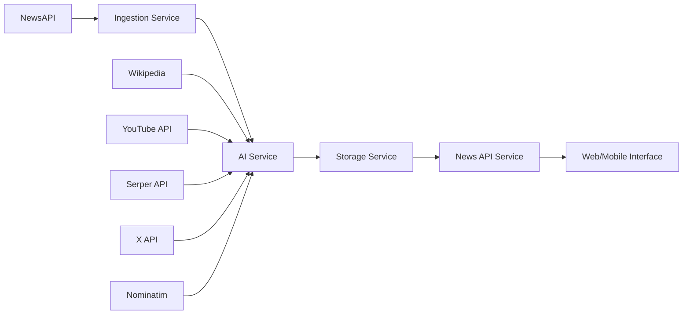

# SWEN AI Pipeline

**AI-Powered News Curation and Enhancement Platform**

SWEN is a platform that curates and enhances news content using AI. It aggregates news from multiple sources, processes the content with advanced AI models, and presents enriched news through web and mobile interfaces.

## Architecture Overview

The current implementation reflects the SWEN architecture through a microservices approach built on NestJS, with clear separation of concerns across the data processing pipeline:

### Core Components

#### 🔄 **Ingestion Service** (`apps/ingestion/`)
*Maps to: External Systems Integration & Ingestion Services*
- Fetches news from NewsAPI with Africa-focused content
- Processes and filters articles (minimum 200 characters)
- Emits processed news events to the AI processing pipeline
- **Key Features:** Automated content ingestion, quality filtering

#### 🤖 **AI Processing Service** (`apps/ai/`)
*Maps to: AI Processing Layer & Custom AI Models*
- **Primary AI Model:** Qwen 2.5-VL-72B via **OpenRouter**
- **Content Enhancement:**
  - Generates summaries and relevance scores
  - Extracts hashtags and creates media justifications
  - Identifies key entities for enrichment
- **Multi-Source Data Enrichment:**
  - Wikipedia context snippets
  - Geographic coordinates via Nominatim
  - Google Maps integration
  - Search trend analysis via Serper API
  - Social sentiment from X (Twitter) API
  - Media assets (images via Serper, videos via YouTube API)

#### 💾 **Storage Service** (`apps/storage/`)
*Maps to: Data Storage & Management*
- Supabase integration for scalable data persistence
- Handles enriched news storage with full context
- **Database Schema:** Structured for news articles with media and contextual data

#### 📰 **News API Service** (`apps/news/`)
*Maps to: Presentation Layer*
- RESTful API for news consumption
- Individual article retrieval with full enrichment
- **Endpoints:** `/news` (list), `/news/:id` (detail)

#### 🌐 **Main Application** (`apps/swen/`)
*Maps to: SWEN.CO Central Platform*
- Central orchestration and web interface
- Future integration point for mobile app and map-based views

### 📚 **Shared Library** (`libs/shared/`)
- Common DTOs and type definitions
- Ensures consistency across microservices
- **Key Models:** NewsDto, MediaDto, ContextDto, GeoDto

## AI Tools Usage Examples

### 🧠 **Qwen 2.5-VL-72B Implementation**
The project extensively uses Qwen for multiple AI-powered features:

**Content Analysis & Enhancement:**
```typescript
// AI-driven content enrichment with structured JSON output
const completion = await this.openai.chat.completions.create({
  model: 'qwen/qwen2.5-vl-72b-instruct:free',
  messages: [{
    role: 'system',
    content: 'You are an AI content enrichment model for African news...'
  }],
  response_format: { type: 'json_object' }
});
```

**Sentiment Analysis Pipeline:**
```typescript
// Social media sentiment analysis using Qwen
const sentimentAnalysis = await this.openai.chat.completions.create({
  model: 'qwen/qwen2.5-vl-72b-instruct:free',
  messages: [{
    role: 'system',
    content: 'You are a sentiment analysis model...'
  }],
  temperature: 0.0
});
```

**Self-Healing JSON Processing:**
```typescript
// AI-powered JSON error recovery
const fixerCompletion = await this.openai.chat.completions.create({
  model: 'qwen/qwen2.5-vl-72b-instruct:free',
  messages: [{
    role: 'system',
    content: 'You are a JSON fixer. Fix invalid JSON strings.'
  }]
});
```

### 🔍 **Multi-API Integration for Enhanced Context**

**Geographic Intelligence:**
- **Nominatim API:** Location extraction and geocoding
- **Google Maps:** Interactive map URL generation
- **Implementation:** Automatic geo-tagging of location-based news

**Media Enhancement:**
- **Serper API:** Contextual image discovery
- **YouTube API:** Related video content
- **Pexels API:** High-quality stock imagery (configured)

**Trend Analysis:**
- **Google Search Trends:** Real-time topic popularity
- **X (Twitter) API:** Social sentiment tracking
- **Custom Algorithm:** Week-over-week growth calculations

### ⚡ **AI-Accelerated Development Examples**

1. **Rapid Prototyping:** Used Qwen to generate initial DTO structures and service templates
2. **Error Handling:** Implemented AI-powered JSON error recovery for robust parsing
3. **Content Strategy:** AI-driven relevance scoring specifically tuned for African audience
4. **Multi-modal Processing:** Integrated text, image, and video content through AI coordination

## Technology Stack

- **Framework:** NestJS (Microservices Architecture)
- **Language:** TypeScript
- **AI Platform:** OpenRouter (Qwen 2.5-VL-72B)
- **Database:** Supabase (PostgreSQL)
- **Message Queue:** Redis
- **APIs:** NewsAPI, YouTube, Serper, Nominatim, X (Twitter)
- **Process Manager:** Concurrently

## Project setup

```bash
$ npm install
```

## Compile and run the project

```bash
# development
$ npm run start

# watch mode
$ npm run start:dev

# production mode
$ npm run start:prod
```

## Live API Demo

You can access the live API endpoints to see SWEN in action():

**All News:** [http://swen-ddt-dp1n5c-0fc8f3-69-62-127-97.traefik.me/api/v1/news/](http://swen-ddt-dp1n5c-0fc8f3-69-62-127-97.traefik.me/api/v1/news/) - Returns all processed news articles

**Specific Article:** [http://swen-ddt-dp1n5c-0fc8f3-69-62-127-97.traefik.me/api/v1/news/3d2f9507-5afb-4ad1-a93a-3ccd2b2fb3c7](http://swen-ddt-dp1n5c-0fc8f3-69-62-127-97.traefik.me/api/v1/news/3d2f9507-5afb-4ad1-a93a-3ccd2b2fb3c7) - Returns detailed view of a specific article

These endpoints showcase the AI-enhanced news processing capabilities with enriched content including summaries, context, media, and geographic data.

## Data Flow



## Microservices Architecture Benefits

- **Scalability:** Independent scaling of AI processing vs. data ingestion
- **Fault Tolerance:** Service isolation prevents cascade failures
- **Technology Diversity:** Each service optimized for its specific workload
- **Development Velocity:** Teams can work independently on different services

## Environment Configuration

Copy `.env.example` to `.env` and configure:

```bash
# Database Configuration
SUPABASE_URL=your_supabase_url
SUPABASE_API_KEY=your_supabase_key

# External APIs
NEWS_API_KEY=your_newsapi_key
QWEN_API_KEY=your_openrouter_key
SERPER_API_KEY=your_serper_key
YOUTUBE_API_KEY=your_youtube_key
X_BEARER_TOKEN=your_twitter_bearer_token

# Redis Configuration (for local development)
REDIS_HOST=localhost
REDIS_PORT=6379
```

**Note:** Make sure Redis is running locally on your VPS before starting the microservices.

## Running All Microservices

The project uses `concurrently` to start all microservices simultaneously:

```bash
# Start all microservices at once
npm run start-all
```

This command runs the following services concurrently:
- **News Service** (`npm run start:news`) - Port `3001`
- **Storage Service** (`npm run start:storage`) - Port `3002`
- **AI Service** (`npm run start:ai`) - Port `3003`
- **Ingestion Service** (`npm run start:ingestion`) - Port `3004`

### Individual Service Commands

You can also start services individually:

```bash
# Start individual services
npm run start:news        # News API Service
npm run start:storage     # Storage Service
npm run start:ai          # AI Processing Service
npm run start:ingestion   # Ingestion Service
```

### Prerequisites

1. **Redis Server**: Ensure Redis is running locally:
   ```bash
   sudo systemctl start redis
   # or
   redis-server
   ```

2. **Environment Variables**: Configure your `.env` file with all required API keys

3. **Dependencies**: Install all dependencies:
   ```bash
   npm install
   ```

### Service Architecture

The microservices communicate through Redis message queues and HTTP APIs. The `start-all` script ensures all services start simultaneously, allowing for proper inter-service communication.
